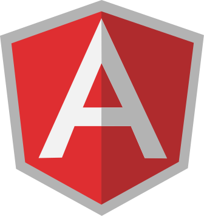

<div align="center">
  
  

#

**Angular functional library**

[](https://www.npmjs.com/package/automatic-release)
[](https://david-dm.org/miguelramos/ng-lab)
[](https://travis-ci.com/miguelramos/ng-lab)
[](https://github.com/miguelramos/ng-lab/LICENSE)


</div>

# Angular Functional Library

Ng-lab are packages to help you on functional/logic helpers that are almost common needs on projects.

## Getting Started

These instructions will get you a copy of the project up and running on your local machine for development and testing purposes. See deployment for notes on how to deploy the project on a live system.

### Prerequisites

- Node
- Npm

### Installing

First check each package describe or just navigate to demo app for more information

|Package|Info|Badge|
|-------|----|-----|
|@ng-lab/support| Many helpers functions and services like: responsive detection, hub for pub/sub |  |

#### For Development

Start to clone the repo as

```
git clone https://github.com/miguelramos/ng-lab.git
```

Then goes to the directory and proceed with the installation

```
cd ng-lab
npm install
```

End with an example of getting some data out of the system or using it for a little demo

## Running the tests

To perform tests please execute:

```
npm test
```

### Break down into end to end tests

Explain what these tests test and why

```
Give an example
```

### And coding style tests

Explain what these tests test and why

```
Give an example
```

## Deployment

Deployment is done automatic by travis every time master accept a PR on github.

## Built With

* [Angular](https://angular.io/) - The web framework used
* [Nx](https://nx.dev) - Angular CLI power-ups for modern development

## Contributing

Please read [CONTRIBUTING.md](https://gist.github.com/PurpleBooth/b24679402957c63ec426) for details on our code of conduct, and the process for submitting pull requests to us.

## Versioning

We use [SemVer](http://semver.org/) for versioning. For the versions available, see the [tags on this repository](https://github.com/your/project/tags). 

## Authors

* **Miguel Ramos** - *Initial work* - [NgLab](https://github.com/miguelramos/ng-lab)

See also the list of [contributors](https://github.com/your/project/contributors) who participated in this project.

## License

This project is licensed under the MIT License - see the [LICENSE.md](LICENSE.md) file for details

## Acknowledgments

* Platforms that i built like... (can't tell you) :)


